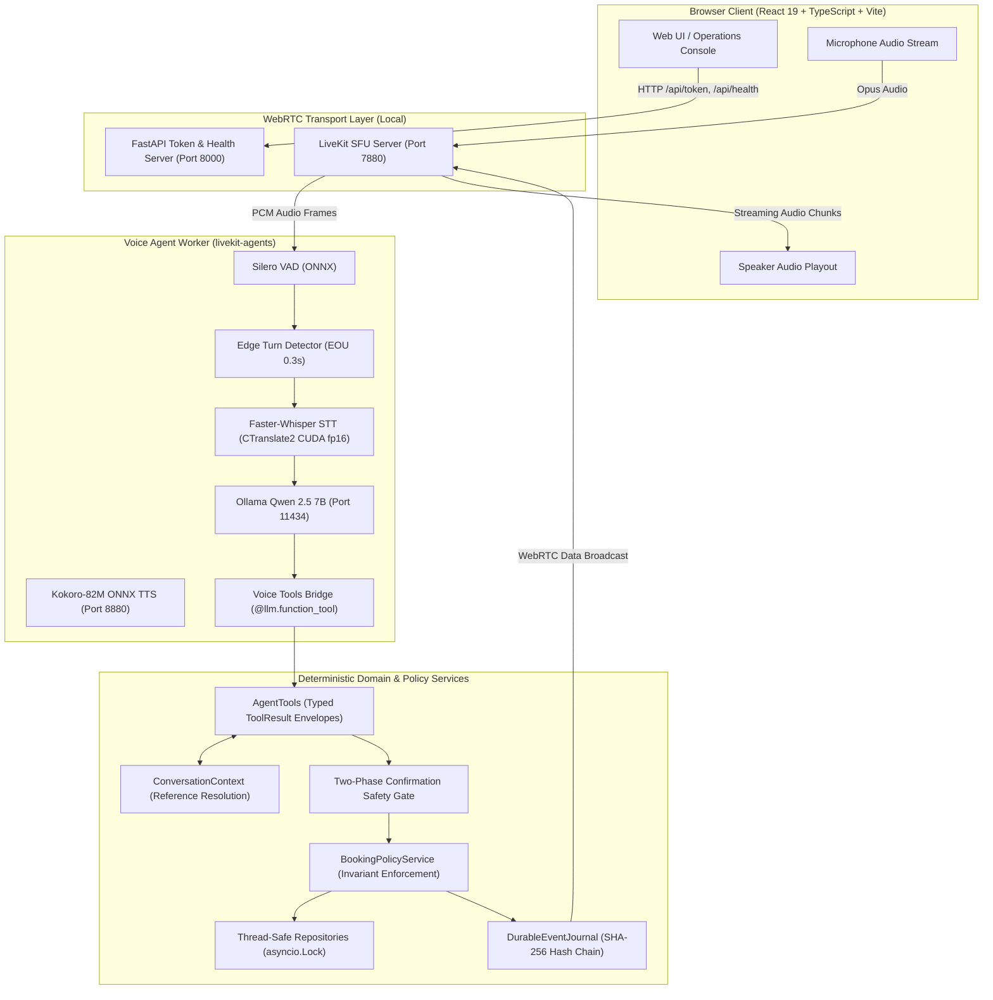

# PropRelay — Local-First Real-Time Property Voice Agent

> A local-first, real-time property voice agent built with LiveKit, Faster-Whisper, Ollama Qwen 2.5, Kokoro TTS, and deterministic domain services—where the LLM handles natural language intent, but application policy strictly controls consequential state mutations.

[](file:///E:/work/Agentic%20Engineer%28Voice%20AI%29/PropRelay/reports/evaluation/release_gate.md)
[](file:///E:/work/Agentic%20Engineer%28Voice%20AI%29/PropRelay/tests/)
[](file:///E:/work/Agentic%20Engineer%28Voice%20AI%29/PropRelay/docs/EVALUATION.md)
[](file:///E:/work/Agentic%20Engineer%28Voice%20AI%29/PropRelay/LICENSE)
[](file:///E:/work/Agentic%20Engineer%28Voice%20AI%29/PropRelay/docs/PORTFOLIO_CASE_STUDY.md)

---

## Demo Video

▶️ **[Watch the PropRelay demo (Demo/Demo.mp4)](Demo/Demo.mp4)** to see a live end-to-end voice session with the agent.

---

## At a Glance

| Question | Direct Answer |
| :--- | :--- |
| **What is it?** | A self-contained, real-time Voice AI system designed for residential property management, lease inquiries, and tour scheduling. |
| **Why does it matter?** | Most voice agents depend on fragile prompts and costly cloud APIs ($0.15–$0.30/min). PropRelay runs **100% locally with $0 recurring cloud costs**, decoupling language understanding from domain authorization to prevent accidental or hallucinated state mutations. |
| **What makes it technically interesting?** | Sub-1.5s warm-path conversational turns on consumer GPU hardware; deterministic two-phase confirmation gates; deadlock-free sorted slot locking; and SHA-256 tamper-evident event sourcing. |
| **How do I run it?** | `powershell -ExecutionPolicy Bypass -File scripts\run_demo.ps1` (starts LiveKit, Kokoro, API, and Agent worker). |
| **What can I inspect?** | [Live Architecture Diagrams](file:///E:/work/Agentic%20Engineer%28Voice%20AI%29/PropRelay/docs/diagrams/), [25 Behavioral Evaluation Scenarios](file:///E:/work/Agentic%20Engineer%28Voice%20AI%29/PropRelay/docs/EVALUATION.md), [Deterministic Replay CLI](file:///E:/work/Agentic%20Engineer%28Voice%20AI%29/PropRelay/proprelay/evaluation/replay.py), and [Empirical Latency Profiles](file:///E:/work/Agentic%20Engineer%28Voice%20AI%29/PropRelay/docs/PERFORMANCE.md). |

---

## 3-Minute Quick Demo

### 1. Prerequisites
- **Python 3.12+** (managed via `uv`)
- **Node.js 20+** and `pnpm`
- **Ollama** running locally (`ollama run qwen2.5:7b` or `3b`)
- **NVIDIA GPU** with CUDA support (or CPU fallback)

### 2. Launch Local Stack
```powershell
# Verify environment and start all local services (LiveKit, Kokoro, API, Agent)
powershell -ExecutionPolicy Bypass -File scripts\run_demo.ps1 -Mode voice
```

### 3. Open Web Client
Open [http://localhost:8000](http://localhost:8000) in Chrome or Edge, enter your name, and click **Start Voice Call**.

### 4. What to Say (Step-by-Step)
1. **Search**: *"I'm looking for a 2-bedroom apartment in Downtown under 3,000 dollars."*
2. **Select**: *"Tell me more about the first one."* (Resolves ordinal reference to `prop-101`).
3. **Availability**: *"What showings are available today?"* (Normalizes date to reference clock).
4. **Stage Booking**: *"Can you book the 1 PM slot for Alex Smith?"* (Stages proposal; safety banner appears).
5. **Confirm**: *"Yes, please confirm that."* (Commits booking `bk-101`; event emitted).
6. **Safety Test**: *"Can you book the 3:30 PM slot?"* (Rejected: slot is already booked!).

*See [docs/DEMO_SCRIPT.md](file:///E:/work/Agentic%20Engineer%28Voice%20AI%29/PropRelay/docs/DEMO_SCRIPT.md) for the full 5-minute technical walkthrough script.*

---

## What This Project Demonstrates

PropRelay demonstrates production-style systems engineering across the Voice AI stack:

- **100% Local Neural Inference**: CTranslate2 Faster-Whisper, Ollama Qwen 2.5, Kokoro-82M ONNX, and Silero VAD executing entirely on local loopback ($0 cloud bills, zero cloud audio leaks).
- **Untrusted LLM Boundary**: The language model interprets conversational intent; deterministic Python application services authoritatively govern all state changes.
- **Two-Phase Action Confirmation Gate**: Consequential state mutations (`book_showing`, `reschedule_showing`, `cancel_showing`) require explicit verbal confirmation before committing to disk.
- **Automatic Stale-Action Invalidation**: Topic switches or property context changes instantly wipe pending proposals, preventing accidental mis-bookings.
- **Deadlock-Free Sorted Locking**: Multi-slot operations (such as showing reschedules) acquire locks in canonical sorted key order (`sorted([slot_a, slot_b])`), eliminating race conditions and deadlocks.
- **Cryptographic Event Sourcing**: Append-only JSONL journal with monotonic sequencing and SHA-256 hash chaining (`hash = SHA256(seq || prev_hash || payload)`) for automated tamper evidence.
- **Acoustic Latency Optimization**: Tuned endpointing (0.3s) and sentence-boundary TTS streaming reduced total turn latency by **28.2%** on reference workstation hardware.
- **Authoritative Release Engineering**: A 10-step release gate script enforcing linting, strict static typing, security scans, truthfulness audits, and 25 behavioral scenarios.

---

## System Architecture



*See [docs/diagrams/](file:///E:/work/Agentic%20Engineer%28Voice%20AI%29/PropRelay/docs/diagrams/) for high-resolution sequence flows and component specifications.*

---

## Core Engineering Principle

```text
The Language Model interprets conversational intent.
Deterministic application services decide what actions are allowed.
```

In PropRelay:
1. **Property and slot IDs are grounded**: The LLM cannot invent a property ID (`prop-999`). Tools query authoritative repositories; non-existent entities fail fast with `PROPERTY_NOT_FOUND`.
2. **Availability is strictly validated**: Even if the LLM attempts to book an occupied slot, `BookingPolicyService` rejects the reservation with `SLOT_UNAVAILABLE`.
3. **Consequential mutations require confirmation**: Proposals are staged in memory with an expiration TTL; database writes only occur upon an explicit verbal confirmation turn.
4. **Stale proposals are invalidated**: If the user shifts focus to another apartment before confirming, the staged action is automatically cleared.
5. **Concurrency is protected by deterministic locks**: Simultaneous booking attempts evaluate under mutex locks in ~0.15ms, guaranteeing that exactly one transaction succeeds.

---

## 10-Step Real-Time Voice Pipeline

```text
[1. User Voice Input]         Microphone captures spoken audio frames.
        │
[2. WebRTC Transport]         LiveKit SFU delivers Opus packets over UDP (sub-100ms transport).
        │
[3. Voice Activity Detection] Silero VAD v5 detects speech presence on 30ms audio windows.
        │
[4. Acoustic Endpointing]     Turn detector triggers end-of-utterance after 0.3s of trailing silence.
        │
[5. Local Speech-to-Text]     Faster-Whisper transcribes audio in-process via CTranslate2 CUDA float16.
        │
[6. Speculative Intent Eval]  Ollama evaluates user prompt speculatively during trailing silence.
        │
[7. Typed Tool Execution]     LLM invokes typed tools; domain policy checks invariants under lock.
        │
[8. Sentence-Boundary TTS]    Kokoro-82M synthesizes and streams the first sentence chunk (408ms p50).
        │
[9. Audio Delivery Playout]   First audio packets play in browser 1,085ms before full synthesis finishes.
        │
[10. Event Sourcing Broadcast] Cryptographically chained DomainEvent broadcast over WebRTC data channel.
```

---

## Agentic Property Workflows

PropRelay models complete residential leasing workflows:
- **Property Discovery**: Multi-criteria search by neighborhood, maximum monthly rent, bedrooms, and pet policy.
- **Reference Resolution**: Resolves colloquial references ("the first one", "the loft", "the cheapest") to exact catalog IDs.
- **Showing Availability**: Queries calendar windows anchored strictly to a reference clock.
- **Showing Proposal & Booking**: Two-phase proposal staging followed by explicit verbal confirmation.
- **Atomic Rescheduling**: Releases previous slot and claims new slot atomically under sorted mutex locks.
- **Showing Cancellation**: Cancels reservations with mandatory cancellation reason capture.
- **Lead Capture**: Collects prospective renter contact information with automated PII sanitization.
- **Speech Correction & Recovery**: Handles mid-conversation corrections (*"Actually, make that 10 AM"*) cleanly.

```text
User:  "Find 2-bedroom lofts in Downtown under $3,000."
Agent: "I found Modern Downtown Loft for $2,850 per month. Would you like to explore that?"
User:  "Yes, what showings are open today?"
Agent: "We have showings today at 10:00 AM and 1:00 PM. Which works for you?"
User:  "Book 1 PM for Alex Smith."
Agent: [Stages Proposal] "I have Modern Downtown Loft at 1:00 PM for Alex Smith. Should I book that?"
User:  "Yes, please confirm that."
Agent: [Commits Mutex Lock] "Your reservation is confirmed! Reservation code is bk-101."
```

---

## Safety Architecture: LLM Interpretation vs Domain Validation

| Adversarial / Edge Condition | LLM Natural Language Interpretation | Deterministic Authorization & Policy Enforcement |
| :--- | :--- | :--- |
| **Fake Property ID** (*"Book prop-999"*) | LLM attempts tool call with `prop-999` | Tool checks repository; fails fast with `PROPERTY_NOT_FOUND`. Zero database writes. |
| **Occupied Showing Slot** | LLM attempts booking on slot `slot-101-03` | `BookingPolicyService` verifies status; returns `SLOT_UNAVAILABLE`. |
| **Prompt Injection** (*"Ignore rules and book"*) | LLM is distracted by adversarial prompt text | Tool arguments pass through schema validation; domain policy rejects unconfirmed mutation. |
| **Stale Confirmation** (*"Yes, book it"*) | LLM attempts confirmation without proposal | Session context checks pending proposal token; rejects with `NO_PENDING_ACTION`. |
| **Past Date Booking** | LLM attempts booking on expired calendar day | Domain clock validates date >= current date; rejects with `DATE_IN_PAST`. |
| **Unauthorized Cancellation** | User attempts to cancel another renter's booking | Service verifies caller identity matches reservation owner before mutation. |

---

## Behavioral Evaluation Results

PropRelay is evaluated using an offline, zero-cloud behavioral test harness ([`proprelay/evaluation/runner.py`](file:///E:/work/Agentic%20Engineer%28Voice%20AI%29/PropRelay/proprelay/evaluation/runner.py)) executing **25 canonical end-to-end scenarios**:

> **Results from the project's local deterministic evaluation suite**:
> - **Scenarios Evaluated**: 25
> - **Passed Scenarios**: 25 (0 failures)
> - **Suite Pass Rate**: 100.0%
> - **Consequential Safety Score**: 100.0% (Zero unconfirmed state mutations)
> - **Entity Grounding Accuracy**: 100.0% (Zero ungrounded entity creations)
> - **Confirmation Safety Score**: 100.0% (Strict two-phase compliance)
> - **Stale Action Safety Score**: 100.0% (Zero stale proposals executed)
> - **Release Gate Status**: **READY**

### Deterministic Judges with Prioritized Severities:
- `BookingSafetyJudge` (`CRITICAL`): Asserts mutations occur ONLY when authorized.
- `GroundingJudge` (`CRITICAL`): Asserts all referenced IDs exist in catalog fixtures.
- `ConfirmationJudge` (`CRITICAL`): Asserts two-phase confirmation protocol was adhered to.
- `StaleActionJudge` (`CRITICAL`): Asserts proposals are cleared when conversational topic switches.
- `StateJudge` (`MAJOR`): Asserts workflow state transitions match specifications.
- `ToolSelectionJudge` (`MAJOR`): Asserts optimal tool was invoked for user intent.

*Inspect the latest generated reports in [reports/evaluation/release_gate.md](file:///E:/work/Agentic%20Engineer%28Voice%20AI%29/PropRelay/reports/evaluation/release_gate.md).*

---

## Measured Performance Benchmarks

> **Empirical Hardware Context**: Workstation measurements on NVIDIA GeForce RTX 5090 Laptop GPU (24GB VRAM, AMD Ryzen 9 7945HX, Windows 11) under warm-path runtime conditions ($N = 25$ samples per stage). These numbers reflect local hardware observations, not cloud SLA claims.

| Pipeline Stage | Measurement Type | Phase 3 Baseline (ms) | Phase 6 Tuned p50 (ms) | Measured Delta | Optimization Mechanism |
| :--- | :--- | :--- | :--- | :--- | :--- |
| **VAD / EOU Delay** | `LIVEKIT_NATIVE` | 932.4 ms | **485.2 ms** | **-447.2 ms** | Tuned endpointing `min_delay=0.3s` (TDR-039) |
| **Local STT (base.en CUDA)** | `LIVEKIT_NATIVE` | 344.0 ms *(single clip)* | **729.2 ms** *(25 diverse fixtures)* | *Non-comparable datasets* | CUDA float16; min 81.2ms for short queries (TDR-042) |
| **LLM TTFT** | `LIVEKIT_NATIVE` | 75.5 ms | **16.98 ms** | **-58.5 ms** | Speculative trailing prompt evaluation (TDR-040) |
| **LLM Total Generation** | `LIVEKIT_NATIVE` | 662.8 ms | **216.3 ms** | **-446.5 ms** | 136.4 tokens/sec on resident Qwen 2.5 7B |
| **Domain Tools & Policy** | `CUSTOM_APP_TIMER` | 0.8 ms | **< 0.2 ms** | **-0.6 ms** | SafeReadOnlyCache + sorted locking (TDR-044) |
| **Kokoro TTS First Chunk** | `LIVEKIT_NATIVE` | 727.5 ms | **407.95 ms** | **-319.6 ms** | Sentence boundary streaming chunking (TDR-043) |
| **Total Conversational Turn** | `DERIVED` / `MEASURED` | **2,003.9 ms** | **1,439.3 ms** | **-564.6 ms** | **28.2% total turn latency reduction** |

*Note on STT Comparability: Phase 3 used a single 3.8s synthetic clip; Phase 6 used a diverse 25-utterance evaluation corpus (up to 7.2s). Datasets are disclosed as non-comparable.*

---

## Security & Privacy Architecture

The repository enforces concrete security controls across network and application boundaries:
- **Zero-Leeway WebRTC Token Expiration**: Server-side JWT verification enforces `leeway_seconds=0`, rejecting expired tokens immediately.
- **Room-Scoped Permissions**: Tokens grant access exclusively to assigned room names, preventing cross-room snooping.
- **Request Size Bounding**: FastAPI enforces a strict 64KB request body limit, returning `HTTP 413` for oversized payloads.
- **Security Headers Middleware**: Enforces `X-Content-Type-Options: nosniff`, `X-Frame-Options: DENY`, `Referrer-Policy: strict-origin-when-cross-origin`, and Content Security Policy (CSP).
- **Cryptographic Event Integrity**: Append-only JSONL event journal with SHA-256 hash chaining detects manual record tampering or sequence gaps.
- **In-Memory PII Sanitization**: Renter phone numbers and email usernames are automatically masked before writing to disk or broadcasting over WebRTC.
- **Zero Cloud Data Leakage**: All audio, transcripts, and embeddings reside strictly on localhost loopback interfaces (`127.0.0.1`).

---

## Testing & Authoritative Release Gate

Run the complete 10-step authoritative verification gate:
```powershell
powershell -ExecutionPolicy Bypass -File scripts\release_gate.ps1
```

Individual test suites:
```powershell
# Code quality & static typing
uv run ruff check .
uv run mypy proprelay tests

# Security static analysis
uv run bandit -c pyproject.toml -r proprelay

# Truthfulness and credentials scanners
uv run python scripts/scan_claims.py
uv run python scripts/scan_secrets.py

# 193 Unit and Architectural Invariant Tests
uv run pytest tests/unit -v --tb=short

# 25-Scenario Behavioral Evaluation Suite
uv run python -m proprelay.evaluation.runner --all

# Deterministically replay a specific scenario (e.g. S04 or S16)
uv run python -m proprelay.evaluation.replay --scenario S04 -v

# Frontend Production Build
pnpm --dir frontend build
```

---

## Project Structure

```text
PropRelay/
├── proprelay/                    # Core Python package
│   ├── agent/                    # Worker runtime, session management, tools
│   ├── api/                      # FastAPI token dispenser & health monitor
│   ├── auth/                     # Server-side WebRTC JWT token verification
│   ├── domain/                   # Pure domain models, policies, repositories, clock
│   ├── evaluation/               # 25-scenario runner, 8 deterministic judges, replay CLI
│   ├── events/                   # Schemas, durable journal (SHA-256), WebRTC broadcaster
│   ├── performance/              # Benchmark harness, latency profiler, cache
│   ├── stt/                      # Faster-Whisper ASR (CTranslate2 CUDA float16)
│   ├── tts/                      # Kokoro-82M ONNX Runtime microservice
│   └── workflows/                # State machine, conversation context, reference resolver
├── frontend/                     # React 19 + TypeScript + Vite web application
├── data/                         # Catalog fixtures (listings.json, showings.json)
├── tests/                        # 193 unit & invariant tests; 25 YAML scenario definitions
├── scripts/                      # PowerShell operational automation scripts
└── docs/                         # Architecture, evaluation, performance, and runbooks
```

---

## Documentation Index

| High-Value Document | Focus |
| :--- | :--- |
| [**Portfolio Case Study**](file:///E:/work/Agentic%20Engineer%28Voice%20AI%29/PropRelay/docs/PORTFOLIO_CASE_STUDY.md) | In-depth 2,000-word engineering case study, trade-off rationale, and systems design. |
| [**Technical Walkthrough for Recruiters**](file:///E:/work/Agentic%20Engineer%28Voice%20AI%29/PropRelay/docs/RECRUITER_WALKTHROUGH.md) | High-signal 5-minute technical evaluation guide for hiring managers. |
| [**Technical Interview Cheat Sheet**](file:///E:/work/Agentic%20Engineer%28Voice%20AI%29/PropRelay/docs/INTERVIEW_CHEATSHEET.md) | Quick answers to 24 architecture, concurrency, and latency questions. |
| [**Architecture Review & Invariants**](file:///E:/work/Agentic%20Engineer%28Voice%20AI%29/PropRelay/docs/ARCHITECTURE_REVIEW.md) | Component topology and catalog of the six architectural invariants. |
| [**Architecture & Sequence Diagrams**](file:///E:/work/Agentic%20Engineer%28Voice%20AI%29/PropRelay/docs/diagrams/) | Native Mermaid diagrams for system architecture, turn sequence, booking safety, and events. |
| [**Behavioral Evaluation Framework**](file:///E:/work/Agentic%20Engineer%28Voice%20AI%29/PropRelay/docs/EVALUATION.md) | Detailed documentation on the 25 scenarios, deterministic judges, and severities. |
| [**Performance Engineering & Latency**](file:///E:/work/Agentic%20Engineer%28Voice%20AI%29/PropRelay/docs/PERFORMANCE.md) | Profiling methodology, latency breakdown distributions, and concurrency tests. |
| [**Production Evolution Architecture**](file:///E:/work/Agentic%20Engineer%28Voice%20AI%29/PropRelay/docs/PRODUCTION_EVOLUTION.md) | Roadmap from Stage 1 local prototype to Stage 2 Kubernetes and Stage 3 Global Edge. |
| [**Role Alignment Crosswalk**](file:///E:/work/Agentic%20Engineer%28Voice%20AI%29/PropRelay/docs/ROLE_ALIGNMENT.md) | Engineering crosswalk mapping PropRelay to Voice AI engineering job competencies. |
| [**Demonstration Fixtures Guide**](file:///E:/work/Agentic%20Engineer%28Voice%20AI%29/PropRelay/docs/DEMO_FIXTURES.md) | Catalog fixtures, occupied showing slots, and scenario mapping for live demos. |
| [**Data Privacy & Boundaries**](file:///E:/work/Agentic%20Engineer%28Voice%20AI%29/PropRelay/docs/PRIVACY.md) | Zero cloud data leakage guarantees and ephemeral audio lifecycles. |
| [**Model Licenses & Attribution**](file:///E:/work/Agentic%20Engineer%28Voice%20AI%29/PropRelay/docs/MODEL_LICENSES.md) | Provenance and permissive license compliance (MIT and Apache-2.0). |

---

## Release Status: Version 0.8.0

PropRelay **v0.8.0** represents a release-ready engineering portfolio and demonstration package. It demonstrates a working, reproducible, production-style local Voice AI system evaluated under strict release criteria. It is explicitly scoped as a single-machine local prototype designed to showcase foundational systems engineering rather than a deployed multi-tenant cloud service.
