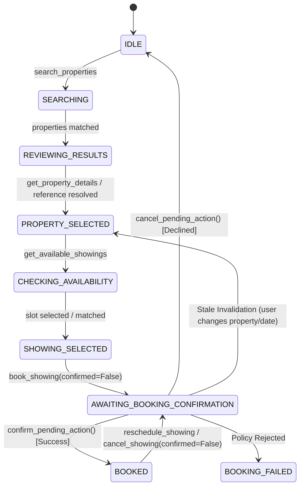
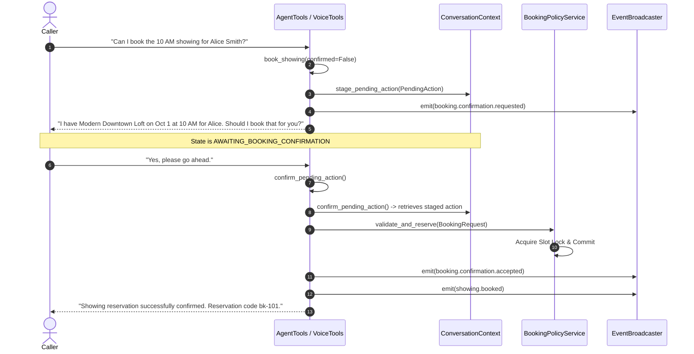

# PropRelay — Agentic Property Workflows & Action Safety Architecture

## 1. Overview & Core Philosophy

In conversational voice AI systems, there is a fundamental difference between a **voice interface sitting on top of independent tools** and a **true agentic domain workflow**. 

When callers interact with a real-estate leasing agent, conversations are non-linear:
- Callers use contextual references ("the first one", "the cheaper property", "the 2 PM slot") instead of database IDs.
- Callers switch topics and interrupt mid-workflow (e.g. asking about parking policies while in the middle of scheduling a showing).
- Callers correct themselves ("Actually, wait, what do you have on Friday instead?").
- Consequential mutations (booking, rescheduling, cancelling reservations) have real-world operational impact and cannot be entrusted to probabilistic LLM judgment alone.

PropRelay addresses these challenges through a **deterministic application-level workflow and action safety layer**. The local LLM (`qwen2.5:7b`) is responsible for natural language comprehension and dialogue generation, but **never for entity persistence, confirmation tracking, or mutation authority**.

```
┌────────────────────────────────────────────────────────────────────────┐
│                        Local Voice Runtime                             │
│       faster-whisper STT  ──►  Ollama Qwen 2.5 7B  ──►  Kokoro ONNX    │
└───────────────────────────────────┬────────────────────────────────────┘
                                    │ Tool Invocations
                                    ▼
┌────────────────────────────────────────────────────────────────────────┐
│                   Structured Application Layer                         │
│   ┌───────────────────────────────┐  ┌───────────────────────────────┐ │
│   │     ConversationContext       │  │     PendingAction Stage       │ │
│   │   • Shortlist & Active Prop   │  │   • ActionType & Turn Limits  │ │
│   │   • Slot Cache & Renter Info  │  │   • Stale Invalidation        │ │
│   │   • Reference Resolvers       │  │   • Deterministic Proposals   │ │
│   └───────────────────────────────┘  └───────────────────────────────┘ │
└───────────────────────────────────┬────────────────────────────────────┘
                                    │ Authorized Requests
                                    ▼
┌────────────────────────────────────────────────────────────────────────┐
│                 Deterministic Domain Policy Engine                     │
│               BookingPolicyService (Sole Authority)                   │
│   • Multi-Slot Deadlock-Free Sorted Locking                            │
│   • Invariant Validation (No double-booking, past dates, mismatches)   │
│   • Append-Only JSONL Event Journal & WebRTC Reliable Data Channel    │
└────────────────────────────────────────────────────────────────────────┘
```

---

## 2. Multi-Turn Workflow State Machine

PropRelay models the conversational lifecycle as an explicit, authoritative finite state machine (`WorkflowState`):



### State Machine Definitions:
- **`IDLE`**: Initial conversational state or post-cancellation idle state.
- **`SEARCHING`**: Active listing catalog query in progress.
- **`REVIEWING_RESULTS`**: Shortlist of matched listings loaded into `ConversationContext`.
- **`PROPERTY_SELECTED`**: A specific property is in conversational focus.
- **`CHECKING_AVAILABILITY`**: Calendar availability for the target listing is loaded into session memory.
- **`SHOWING_SELECTED`**: Caller has expressed interest in a specific showing slot.
- **`AWAITING_BOOKING_CONFIRMATION`**: A consequential action proposal is staged in `PendingAction`. The agent requires explicit confirmation before mutating database records.
- **`BOOKED`**: Showing reservation is authoritatively confirmed and locked in the repository.

---

## 3. Conversational Context & Reference Resolution

The `ConversationContext` object ([`proprelay/workflows/context.py`](file:///E:/work/Agentic%20Engineer%28Voice%20AI%29/PropRelay/proprelay/workflows/context.py)) persists structured domain state across turns, eliminating the need to re-parse or hallucinate entity references.

### Reference Resolvers:
1. **Ordinal Resolution (`resolve_property_reference`)**:
   - `"first one"` / `"1st"` -> resolves to index `0` of current shortlist.
   - `"second one"` / `"2nd"` -> resolves to index `1` of current shortlist.
   - `"third one"` / `"3rd"` -> resolves to index `2` of current shortlist.
   - Out-of-bounds queries (e.g. "fifth property" when only 2 exist) deterministically return `None` and prompt clarification, rather than hallucinating an arbitrary property.
2. **Superlative Resolution**:
   - `"cheapest one"` / `"lowest rent"` -> sorts current shortlist by `monthly_rent` ascending and returns minimum.
   - `"most expensive"` / `"highest rent"` -> sorts by `monthly_rent` descending.
3. **Slot Reference Resolution (`resolve_slot_reference`)**:
   - Resolves natural expressions like `"the 2 PM one"`, `"morning slot"`, `"afternoon"` against currently loaded `available_slots`.
   - Rejects unlisted times (e.g. asking for 5 PM when only 10 AM and 2 PM exist).
4. **Deterministic Date Normalization (`normalize_date_expression`)**:
   - Temporal terms (`"today"`, `"tomorrow"`, `"Friday"`, `"next Monday"`, `"October 5th"`) are resolved strictly against an injected `Clock` reference date (`2026-10-01`), never drifting or using uncontrolled host time.

---

## 4. Application-Level Action Confirmation Safety Gate (TDR-025)

### The Architectural Problem
In naive voice implementations, the LLM directly calls mutation functions (e.g. `book_showing()`). If a user says "Tell me what happens if I book that", a naive LLM often triggers the booking immediately. Conversely, if an LLM is asked in a prompt to "only book after getting confirmation", small 7B models frequently forget the rule or misinterpret silence as consent.

### The PropRelay Solution
Every consequential mutation (`book_showing`, `reschedule_showing`, `cancel_showing`) is governed by an **enforced two-phase staging protocol**:



### Stale Action Invalidation (TDR-026)
If the caller receives a confirmation proposal and subsequently pivots:
```
Agent: "I have Modern Downtown Loft on Oct 1 at 10:00 AM for Alice. Should I book that for you?"
Caller: "Wait, actually, what do you have over on Elm Street?"
```
1. Caller's switch to another property or query triggers `ctx.select_property(...)` or `ctx.record_search(...)`.
2. `ConversationContext` detects that the active property has changed and **immediately wipes `pending_action`**.
3. If the caller later says "Okay, book it!", `confirm_pending_action()` fails with structured error `NO_PENDING_ACTION`.
4. The system never executes a stale or obsolete reservation.

---

## 5. Consequential Mutations & Concurrency Invariants

### 1. Showing Rescheduling (`validate_and_reschedule`)
- Atomically moves an active reservation to a new calendar slot.
- **Deadlock-Free Sorted Locking (TDR-028)**:
  To prevent lock inversion when concurrent users swap slots:
  ```python
  slot_ids = sorted([booking.slot_id, target_slot_id])
  async with (
      self._booking_repo.acquire_slot_lock(slot_ids[0]),
      self._booking_repo.acquire_slot_lock(slot_ids[1]),
  ):
      # Atomic swap: release old slot, claim new slot
  ```
- Enforces domain invariants:
  - `BOOKING_NOT_FOUND`: Booking ID does not exist.
  - `BOOKING_ALREADY_CANCELLED`: Cannot reschedule cancelled reservation.
  - `RENTER_MISMATCH`: Caller name must match reservation record.
  - `RESCHEDULE_SAME_SLOT`: Target slot must differ from current slot.
  - `SLOT_UNAVAILABLE`: Target slot must be currently available.

### 2. Showing Cancellation (`validate_and_cancel`)
- Releases the booked calendar slot back to `AVAILABLE`.
- Updates booking record to `BookingStatus.CANCELLED` with timestamp and optional cancellation reason.
- Prevents redundant cancellations (`BOOKING_ALREADY_CANCELLED`).

---

## 6. Observability & Telemetry

### WorkflowMetricsTracker ([`proprelay/observability/metrics.py`](file:///E:/work/Agentic%20Engineer%28Voice%20AI%29/PropRelay/proprelay/observability/metrics.py))
Tracks multi-turn conversational efficiency separately from raw pipeline audio latency:
- **`workflow_duration_ms`**: Total elapsed time from first search to terminal booking/cancellation.
- **`tool_calls_per_workflow`**: Count and breakdown of agent tool executions.
- **`clarification_count`**: Number of times the agent requested clarification due to ambiguous input.
- **`confirmation_proposals_count`**: Proposals staged.
- **`confirmation_count`**: User authorizations granted.
- **`rejected_action_count`**: Domain policy rejections.
- **`workflow_completed` / `workflow_abandoned`**: Terminal workflow status flags.

### WebRTC Domain Event Stream
All state changes and safety transitions emit structured `DomainEvent` envelopes over LiveKit reliable data channels:
- `property.search.completed`
- `property.details.viewed`
- `showing.availability.checked`
- `booking.confirmation.requested`
- `booking.confirmation.accepted`
- `booking.confirmation.declined`
- `showing.booked`
- `showing.reschedule.requested`
- `showing.rescheduled`
- `showing.cancellation.requested`
- `showing.cancelled`
- `workflow.state.changed`

---

## 7. Frontend Integration & Operator Visibility

The React operator dashboard ([`frontend/src/App.tsx`](file:///E:/work/Agentic%20Engineer%28Voice%20AI%29/PropRelay/frontend/src/App.tsx)) provides real-time visibility into agentic workflows:

1. **Workflow State Pill**: Color-coded pill in the session header reflecting current state machine status (`Awaiting Confirmation`, `Showing Booked`, `Property Selected`, etc.).
2. **Action Confirmation Safety Gate Banner**: High-visibility banner rendered when a proposal is in-flight:
   - Displays the staged `ActionType` (`BOOK SHOWING`, `RESCHEDULE SHOWING`, `CANCEL SHOWING`).
   - Quotes the authoritative proposal sentence presented to the renter.
   - Clarifies the voice commands needed to confirm or decline.
3. **Active Property Card**: Displays the currently focused listing with address, rent, bedrooms, and specs.
4. **Live Turn Latency Card**: STT, TTFT, TTS, and end-of-utterance latency metrics.
5. **WebRTC Domain Events Stream**: Real-time event log with expandable JSON payloads.
