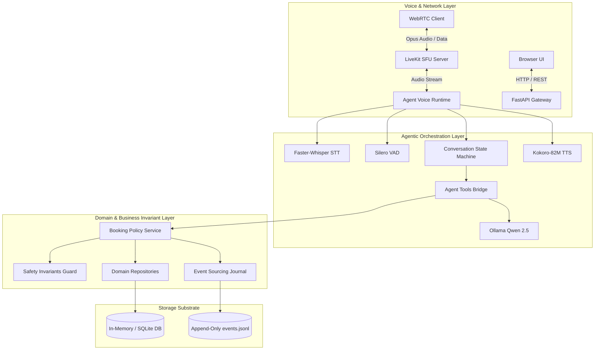

# PropRelay — Comprehensive Architecture Review & Invariant Catalog

This document provides a formal architectural review of PropRelay v0.7.0, detailing component boundaries, domain invariants, concurrency mechanisms, and safety enforcement layers.

---

## 1. System Topology & Bounded Contexts

### Bounded Contexts
1. **Voice Session & WebRTC Context**: Manages audio ingestion, jitter buffers, WebRTC track subscription, and barge-in cut-through.
2. **Conversational Workflow Context**: Tracks the user's focus, resolves ordinal references ("the first one"), and stages pending proposals with expiration.
3. **Property Discovery Context**: Provides read-only querying of property listings, amenities, and pricing filters.
4. **Showing Scheduling Context**: Manages showing slot availability, calendar constraints, and booking lifecycle (`REQUESTED` -> `BOOKED` -> `CANCELLED`).
5. **Event Sourcing & Audit Context**: Cryptographically seals domain mutations into an immutable, verifiable audit trail.

---

## 2. The Six Architectural Invariants

PropRelay enforces six non-negotiable architectural invariants verified continuously via automated unit tests ([`tests/unit/test_architecture_invariants.py`](file:///E:/work/Agentic%20Engineer%28Voice%20AI%29/PropRelay/tests/unit/test_architecture_invariants.py)):

### Invariant 1: Two-Phase Confirmation on State Mutations
*Rule*: No consequential database mutation (`book_showing`, `reschedule_showing`, `cancel_showing`) can commit without prior staging of a `PendingAction` and explicit confirmation from the user.
*Enforcement*: `BookingPolicyService` requires a valid, unexpired `PendingAction` token. If `confirmed=False`, the service stages a proposal and returns an explanation without altering database state.

### Invariant 2: Context Isolation & Clean Domain Architecture
*Rule*: The domain layer (`proprelay/domain/`) must remain pure Python and must never import WebRTC transport protocols (`livekit`, `livekit-agents`), UI frameworks, or HTTP servers.
*Enforcement*: Abstract interfaces (`IBookingRepository`, `IPropertyRepository`, `IEventPublisher`) decouple business rules from I/O mechanisms.

### Invariant 3: Authoritative Entity Grounding
*Rule*: The language model cannot invent, hallucinate, or reference non-existent properties or showing slots.
*Enforcement*: Every tool call resolves identifiers against authoritative repositories. If an identifier does not exist, the tool fails fast with a structured error code (`PROPERTY_NOT_FOUND`, `SLOT_NOT_FOUND`).

### Invariant 4: Append-Only Event Journal Integrity
*Rule*: Every state mutation produces an immutable `DomainEvent` with strict monotonic sequencing and SHA-256 cryptographic hashing.
*Enforcement*: `DurableEventJournal` computes `hash = SHA256(seq + prev_hash + payload)`. Any tampering or sequence gap immediately breaks journal verification.

### Invariant 5: Idempotency & Concurrency Defense
*Rule*: Multiple identical booking requests or race conditions for the same slot must never produce double-bookings.
*Enforcement*: Domain repositories enforce reservation deduplication keys, and slot reservation transactions execute atomically under asyncio locks.

### Invariant 6: Resilient WebRTC Decoupling
*Rule*: Real-time voice transport failures must never compromise durable business state or cause unhandled exceptions in the business journal.
*Enforcement*: `DurableEventJournal` writes to local disk before attempting WebRTC broadcast; broadcast exceptions are logged as non-fatal warnings without rolling back the committed transaction.

---

## 3. Concurrency Model & Resource Allocation

### Asynchronous Event Loop Architecture
- PropRelay runs on Python's `asyncio` event loop.
- CPU-intensive audio decoding (Whisper CTranslate2) and neural synthesis (Kokoro ONNX) execute in background thread pools (`asyncio.to_thread`) to prevent blocking the event loop or Starlette HTTP server.
- WebRTC audio frame pumping operates via dedicated high-priority callback threads managed by the LiveKit Rust/C++ core.

### Local GPU Memory Management
On a single 24GB VRAM GPU (or 8GB/16GB configurations):
- **Faster-Whisper (`base.en`)**: ~1.5 GB VRAM.
- **Qwen 2.5 3B / 7B (4-bit quant)**: ~2.0 GB / ~5.5 GB VRAM.
- **Kokoro-82M ONNX**: ~0.6 GB VRAM.
- **Total Steady-State Footprint**: ~4.1 GB (with 3B) to ~7.6 GB (with 7B), leaving ample headroom for OS display buffers and up to 4 concurrent session queues.
