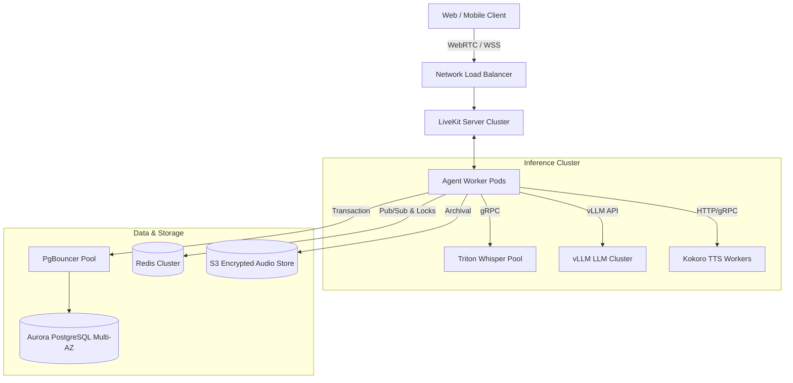

# PropRelay — Production Evolution Architecture

This document outlines the systematic evolutionary roadmap of PropRelay, detailing how the zero-cost local architecture scales into high-availability, multi-tenant cloud environments across three distinct operational stages.

---

## 1. Evolution Overview & Architectural Stages

```
+-----------------------------------------------------------------------------------+
| Stage 1: Zero-Cost Local Prototype (Current Implementation)                      |
| Single Node (Dev Workstation / RTX GPU) | $0/month | Zero External Cloud          |
| WebRTC: Local LiveKit | STT: Faster-Whisper | LLM: Ollama | TTS: Kokoro-82M ONNX  |
+-----------------------------------------------------------------------------------+
                                         │
                                         ▼
+-----------------------------------------------------------------------------------+
| Stage 2: Single-Region Cloud Production Concept                                   |
| Kubernetes Cluster (EKS/GKE) | Scaled Audio Workers | Dedicated GPU Pool          |
| WebRTC: LiveKit Distributed | STT: vLLM / Triton Whisper | LLM: vLLM | TTS: Triton|
| Storage: Managed PostgreSQL + pgbouncer | Ephemeral Cache: Managed Redis Cluster |
+-----------------------------------------------------------------------------------+
                                         │
                                         ▼
+-----------------------------------------------------------------------------------+
| Stage 3: Multi-Region Global Edge Production Concept                              |
| Geo-Distributed Edge Ingress | Anycast Routing | Regional GPU Inference Nodes     |
| WebRTC: LiveKit Edge Mesh | Edge Audio Ingress | Global Database Replication     |
| Telephony SIP Trunks (Twilio/Telnyx) | Multi-Cluster Failover | SLO: 99.99% Uptime|
+-----------------------------------------------------------------------------------+
```

---

## 2. Stage 1: Current Zero-Cost Local Architecture

### Technical Characteristics
- **Cost**: **$0.00 / month** recurring cloud infrastructure.
- **Compute Substrate**: Developer workstation (Single NVIDIA CUDA GPU or CPU fallback).
- **WebRTC Server**: Local standalone LiveKit Server binary (`127.0.0.1:7880`) running on localhost loopback.
- **Speech-to-Text**: Faster-Whisper (`base.en`) running locally via CTranslate2 in int8 CPU or float16 CUDA mode.
- **Language Model**: Ollama serving `Qwen2.5-3B-Instruct` (or `7B`) locally using 4-bit quantization (GGUF).
- **Text-to-Speech**: Local Kokoro-82M ONNX runtime serving synthesized audio chunks via HTTP/FastAPI.
- **Persistence & Journal**: In-memory repository with optional durable SQLite file persistence and append-only JSON-lines journal.
- **Concurrency Capacity**: 1 to 2 concurrent voice sessions without scheduling contention; up to 4 concurrent sessions with ~15–20% queuing latency overhead on a single consumer GPU.

### Failure Domains & Mitigations (Stage 1)
| Failure Mode | Impact | Stage 1 Mitigation |
| :--- | :--- | :--- |
| **GPU VRAM Exhaustion** | Model crash or CUDA OOM | Sequential scheduling, small quantized weights (3B params), aggressive memory reclamation. |
| **Local Process Termination** | Live voice call disconnect | Process restart; client WebRTC auto-reconnect logic. |
| **Audio Pipeline Deadlock** | Voice agent stops responding | 15.0s per-turn inference timeouts; async cancellation tokens. |

---

## 3. Stage 2: Single-Region Cloud Production Architecture

### Technical Characteristics
- **Compute Substrate**: Kubernetes (Amazon EKS or Google GKE) across 3 Availability Zones.
- **WebRTC Transport**: Distributed LiveKit Server cluster behind Network Load Balancers (NLBs) with TURN/STUN egress.
- **Inference Engine**:
  - **STT Pool**: Autoscaling GPU workers running Triton Inference Server with Faster-Whisper or TensorRT-LLM Whisper.
  - **LLM Pool**: Scaled vLLM instances serving Qwen 2.5 7B/14B with continuous batching and PagedAttention.
  - **TTS Pool**: Autoscaled CPU/GPU workers running Kokoro ONNX or FastSpeech2 with pipelined chunking.
- **Persistence**: Managed PostgreSQL (Amazon RDS Aurora Multi-AZ) with `pgbouncer` connection pooling.
- **Cache & Pub/Sub**: Managed Redis Cluster (Amazon ElastiCache) for distributed session tracking, active locks, and ephemeral event dispatch.
- **Blob Storage**: S3-compatible bucket for encrypted audio recording archives, transcripts, and model weights.
- **API & Orchestration**: FastAPI microservices horizontally scaled using Kubernetes Horizontal Pod Autoscaler (HPA) based on CPU/GPU utilization and queue depth.

### Component Topology (Stage 2)


### Cost Modeling (Estimated Monthly at 100 Peak Concurrent Calls)
- EKS Control Plane + Nodes (c6i.2xlarge): ~$450/month
- GPU Inference Pool (2x g5.2xlarge A10G instances): ~$1,500/month
- Managed Aurora PostgreSQL + ElastiCache Redis: ~$350/month
- Network Egress & Load Balancing: ~$180/month
- **Total Estimated Stage 2 Budget**: **~$2,480/month** (~$0.012 per minute of active voice dialogue).

---

## 4. Stage 3: Multi-Region Global Edge Architecture

### Technical Characteristics
- **Network Ingress**: Geo-DNS with Anycast routing (Cloudflare / AWS Global Accelerator) routing users to the nearest regional edge data center.
- **Edge Media PoPs**: LiveKit Edge media relays deployed in North America, Europe, and Asia-Pacific to terminate WebRTC media within <30ms RTT of end users.
- **Edge Transcription**: Lightweight Whisper ASR deployed at regional edge compute nodes for immediate localized transcription.
- **Global Data Layer**: Distributed CockroachDB or AWS Aurora Global Database for multi-region active-active read replicas with single-region transactional write primaries.
- **Telephony Ingress**: Multi-carrier SIP trunking (Twilio + Telnyx) with automated failover for PSTN dial-in and dial-out.
- **Target SLO**: 99.99% uptime (< 4.38 minutes downtime per month); p95 turn latency < 1,200ms globally.

---

## 5. Architectural Invariant Evolution Matrix

The foundational architectural guarantees established in Phase 7 are preserved across all stages:

| Architectural Invariant | Stage 1 (Local) | Stage 2 (Single-Region Cloud) | Stage 3 (Global Edge) |
| :--- | :--- | :--- | :--- |
| **Two-Phase Confirmation** | In-memory pending action state machine | Distributed Redis pending action with TTL | Redis Global Datastore with distributed consensus |
| **Slot Booking Atomicity** | Python `asyncio.Lock` + repository check | PostgreSQL `SELECT FOR UPDATE` transaction | Multi-region distributed transaction (Serializable) |
| **Strict Tool Grounding** | In-memory repository lookup | PostgreSQL parameterized query | Read-replica SQL query with read-your-writes consistency |
| **Event Journal Integrity** | Append-only JSONL with SHA-256 hash | Kafka / AWS Kinesis event stream with schema registry | Distributed Kafka / Redpanda with replication factor 3 |
| **Idempotency Defense** | In-memory reservation deduplication key | PostgreSQL unique constraint on `(property_id, slot_id, status)` | Globally distributed unique constraint |
| **Voice Interruption (Barge-in)** | Local WebRTC cancellation event | Distributed WebRTC cancellation via Redis Pub/Sub | Edge media relay hardware VAD cut-through |

---

## 6. Migration & Adoption Roadmap

1. **Stage 1 -> Stage 2 Readiness**:
   - Replace in-memory repositories with SQLModel / SQLAlchemy interfaces adhering to `IBookingRepository` and `IPropertyRepository`.
   - Externalize LiveKit URL and credentials via Kubernetes ConfigMaps and Vault secrets.
   - Containerize inference endpoints into Triton and vLLM Docker images.
2. **Stage 2 -> Stage 3 Readiness**:
   - Deploy LiveKit Edge distribution relays.
   - Configure SIP trunking gateways for inbound PSTN bridging.
   - Establish multi-region disaster recovery runbooks and automated Chaos Engineering drills.
