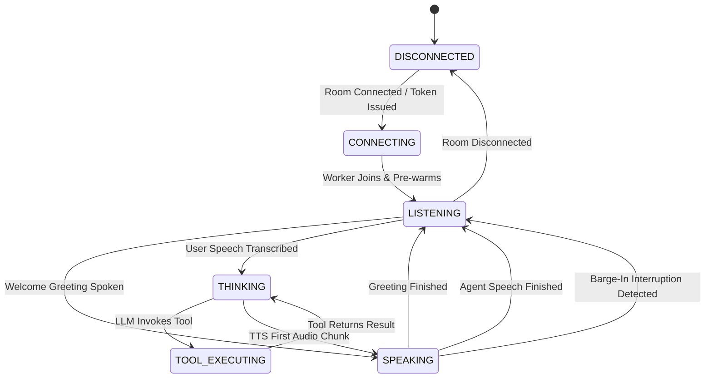

# PropRelay — Realtime Voice Pipeline Architecture

## 1. Overview & Architecture Goals

Phase 3 transforms PropRelay from a deterministic backend domain engine into an interactive, zero-cloud-cost ($0), ultra-low-latency realtime voice agent.

```
                      +---------------------------------------+
                      |         Web Browser Client            |
                      |   (React 19 + TypeScript + Vite)      |
                      +---+-------------------------------+---+
                          | Microphone (Opus 48kHz)       ^ Spoken Audio
                          | WebRTC PeerConnection         | (WAV/Opus 24kHz)
                          v                               |
+-------------------------------------------------------------+---------+
|                  LiveKit WebRTC Server (Port 7880)                    |
+---------------------------------+-------------------------------------+
                                  | WebRTC Audio Tracks & Data Channel
                                  v
+-----------------------------------------------------------------------+
|                PropRelay Voice Worker (LiveKit Agents 1.8)            |
|                                                                       |
|   1. Audio Ingestion & Resampling                                     |
|      - livekit.rtc.AudioStream -> 16kHz float32 mono                  |
|                                                                       |
|   2. Silero VAD (Voice Activity Detection)                            |
|      - Local ONNX Silero VAD buffers speech chunks                    |
|      - START_OF_SPEECH & END_OF_SPEECH boundary detection            |
|                                                                       |
|   3. Faster-Whisper Speech-to-Text (STT)                              |
|      - Model: Systran/faster-whisper-base.en                          |
|      - Device: NVIDIA CUDA (RTX 5090 float16 compute)                 |
|      - StreamAdapter: Endpointed transcription (~340ms)               |
|                                                                       |
|   4. Turn Detection & EOU Prediction                                  |
|      - Model: turn-detector-v1-mini (Local ONNX)                      |
|      - End-of-turn probability evaluation                             |
|                                                                       |
|   5. Local LLM Reasoning (Ollama qwen2.5:7b)                          |
|      - Base URL: http://127.0.0.1:11434/v1 (OpenAI-compatible)        |
|      - Spoken leasing concierge system prompt                         |
|      - Function calling schema for domain tools                       |
|                                                                       |
|   6. Typed Domain Tools Execution                                     |
|      - search_properties, get_property_details                        |
|      - get_available_showings, book_showing, create_lead              |
|      - Deterministic policy enforcement (TDR-007, TDR-011)            |
|      - Idempotency & slot mutexes (TDR-008, TDR-009)                  |
|                                                                       |
|   7. Local Kokoro ONNX Text-to-Speech (TTS)                           |
|      - Base URL: http://127.0.0.1:8880/v1 (Port 8880 FastAPI)         |
|      - Weights: kokoro-v1.0.onnx + voices-v1.0.bin                    |
|      - Voice: af_alloy (24kHz studio-quality natural speech)          |
|                                                                       |
|   8. Realtime Event Broadcasting                                      |
|      - Low-latency WebRTC Data Channel (Topic: 'proprelay.events')     |
|      - State & telemetry UI synchronization with typed DomainEvents    |
+-----------------------------------------------------------------------+
```

---

## 2. Component Specifications

### 2.1 Audio Ingestion & Resampling (`proprelay/stt/faster_whisper.py`)
- **Transport**: LiveKit WebRTC audio track subscribed from human participant.
- **Resampling**: Input audio (typically 48kHz or 24kHz WebRTC Opus frames) is passed through `rtc.AudioResampler` caching resamplers per input sample rate to yield a single 16,000Hz mono PCM buffer.
- **Normalization**: 16-bit integer PCM is converted to normalized `float32` in `[-1.0, 1.0]` for direct CTranslate2 inference.

### 2.2 Voice Activity Detection (Silero VAD)
- **Engine**: Silero VAD ONNX model running locally via `livekit-plugins-silero`.
- **Configuration**:
  - `min_speech_duration`: 0.15s
  - `min_silence_duration`: 0.5s
  - `prefix_padding_duration`: 0.2s

### 2.3 Local Speech-to-Text (Faster-Whisper)
- **Model**: `base.en` (English-only optimized model).
- **Inference Runtime**: CTranslate2 running on `cuda` with `float16` precision.
- **Pre-warming**: On worker startup, a 100ms silent tensor is pushed through `WhisperModel.transcribe` to allocate CUDA memory and compile kernels, reducing first-turn latency.
- **Streaming Strategy**: LiveKit's `stt.StreamAdapter` consumes Silero VAD chunks, yielding an endpointed `FINAL_TRANSCRIPT` upon speech cessation without interim transcript drift.

### 2.4 Local Turn Detection (`v1-mini`)
- **Model**: `turn-detector-v1-mini` via `livekit-plugins-turn-detector` / `livekit.agents.inference.TurnDetector`.
- **Execution Mode**: 100% local ONNX execution.
- **Decision Engine**: Evaluates speech completion probabilities against dynamic thresholds (`unlikely_threshold=0.36`), committing user turns within 0.5s of speech completion.

### 2.5 Local Language Model (Ollama `qwen2.5:7b`)
- **Engine**: Local Ollama server exposing OpenAI-compatible chat completions at `http://127.0.0.1:11434/v1`.
- **System Prompt**: Enforces professional leasing concierge persona, concise spoken outputs (1-2 sentences), natural phrasing, zero markdown lists or complex formatting in speech, and strict adherence to authoritative property data.
- **Tool Calling**: LiveKit native dynamic function calling via function definitions with typed Pydantic parameters.

### 2.6 Typed Domain Tools (`proprelay/agent/voice_tools.py`)
- Tools registered with `@llm.function_tool`:
  1. `search_properties(location, max_rent, bedrooms, pets_allowed)`
  2. `get_property_details(property_id)`
  3. `get_available_showings(property_id, date)`
  4. `book_showing(property_id, slot_id, renter_name, renter_phone, renter_email, expected_date)`
  5. `create_lead(name, phone, email, preferred_neighborhood, budget, interested_property_id, notes)`
- **Invariants**: All calls delegate to Phase 2 `AgentTools`, executing through `BookingPolicyService`, per-slot mutexes, and idempotency key derivation. Results are serialized to JSON dictionaries for LLM ingestion.

### 2.7 Local Text-to-Speech (Kokoro ONNX)
- **Architecture**: Standalone FastAPI service on port 8880 providing OpenAI-compatible `/v1/audio/speech`.
- **Model Weights**: `kokoro-v1.0.onnx` (82M parameters, ~325MB) + `voices-v1.0.bin` (~28MB).
- **Voice**: `af_alloy` (warm, natural American female voice) at 24,000Hz sampling rate.
- **Format**: Standard WAV audio streaming directly into LiveKit RTC audio sink proxy.

### 2.8 Interruption & Barge-in Handling
- **Mode**: Local VAD-based interruption (`interruption={"enabled": True, "mode": "vad", "min_duration": 0.3}`).
- **Zero Cloud Leak**: Bypasses cloud-based adaptive barge-in (`wss://agent-gateway.livekit.cloud/v1/bargein`), operating fully offline.
- **Barge-in Behavior**: When the human speaks for more than 300ms while the agent is speaking:
  1. LiveKit immediately cancels active TTS audio playback.
  2. The LLM response stream is aborted.
  3. State transitions from `SPEAKING` to `LISTENING`.
  4. User speech is captured and routed to STT without dropped frames.

### 2.9 WebRTC Data Channel Event Stream (`proprelay/events/broadcaster.py`)
- **Transport**: LiveKit WebRTC Data Channel on topic `proprelay.events`.
- **Reliability & Delivery**: Configured with `reliable=True` (SCTP retransmission). While low-latency (~5-15ms local transport), it is treated as a best-effort realtime projection with client-side deduplication (`seenEventIdsRef`). Durable state is committed authoritatively to `data/events.jsonl`.
- **Payload**: Full `DomainEvent` JSON schemas (state transitions, tool executions, transcripts, latency metrics).
- **Delivery Path**: Transmitted directly to the React browser client via `RoomEvent.DataReceived`.

---

## 3. State Machine & Event Flow


