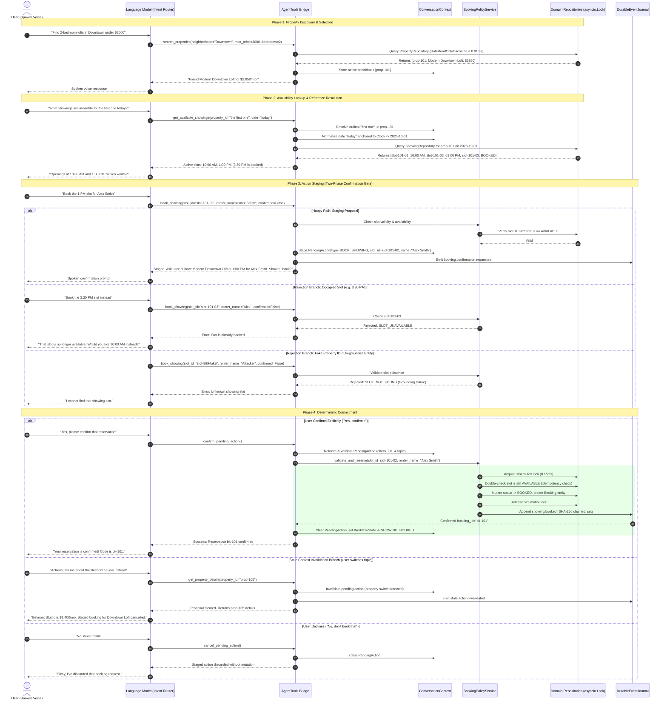

# Booking Safety & Invariant Sequence Diagram

This sequence diagram illustrates PropRelay's deterministic safety architecture governing consequential actions. It contrasts natural language interpretation against authoritative domain enforcement and highlights rejection branches.

## Security Invariant Guarantees

1. **Zero Direct LLM Mutation**: The LLM has zero database access handles. All mutations require passing through `BookingPolicyService`.
2. **Mandatory Confirmation Protocol**: Calling `book_showing` with `confirmed=False` never commits a booking; it only stages a short-lived `PendingAction`. Calling `confirm_pending_action()` fails if no proposal was staged or if context switched.
3. **Hardware-Anchored Grounding**: Fabricated IDs (`prop-999`, `slot-fake`) return deterministic error envelopes (`PROPERTY_NOT_FOUND`, `SLOT_NOT_FOUND`) with zero state changes.
4. **Sorted Lock Concurrency**: Simultaneous booking or rescheduling requests acquire locks in canonical sorted key order (`sorted([slot_a, slot_b])`), eliminating database deadlocks and double-booking races.
