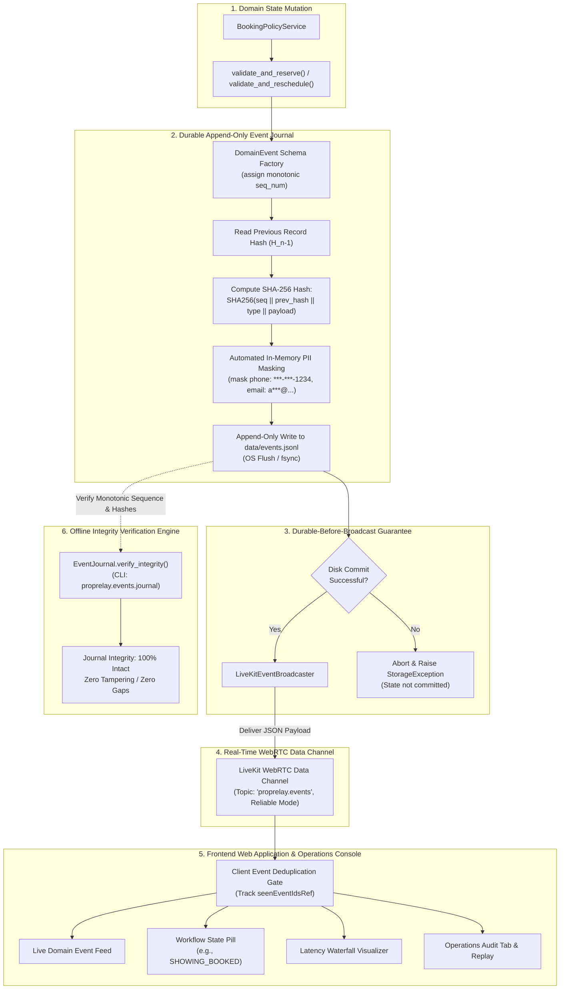

# Event Sourcing & Realtime Delivery Flow

This diagram illustrates PropRelay's event-driven architecture, documenting how domain state mutations are cryptographically sealed, persisted to disk, and broadcast to the WebRTC client and operations console.

## Architectural Invariants Enforced in the Event Path

1. **Durable-Before-Broadcast**: Events are written to the local disk journal before transmission over the WebRTC data channel. If disk persistence fails, no event is broadcast, preventing phantom state divergence.
2. **Cryptographic Tamper-Evidence**: Each event includes `sequence_number`, `timestamp`, `event_type`, `payload`, and `previous_event_hash`. A cryptographic SHA-256 hash chains each record to its predecessor. Any modification or deletion of past events breaks the verification chain.
3. **Automated PII Sanitization**: Contact information (such as telephone numbers and email addresses) undergoes automated masking prior to disk write and network broadcast, protecting prospective renter privacy.
4. **Client-Side Deduplication**: The React client maintains an in-memory set of processed event IDs (`seenEventIdsRef`) to prevent duplicate UI rendering in the event of WebRTC transport retries.
