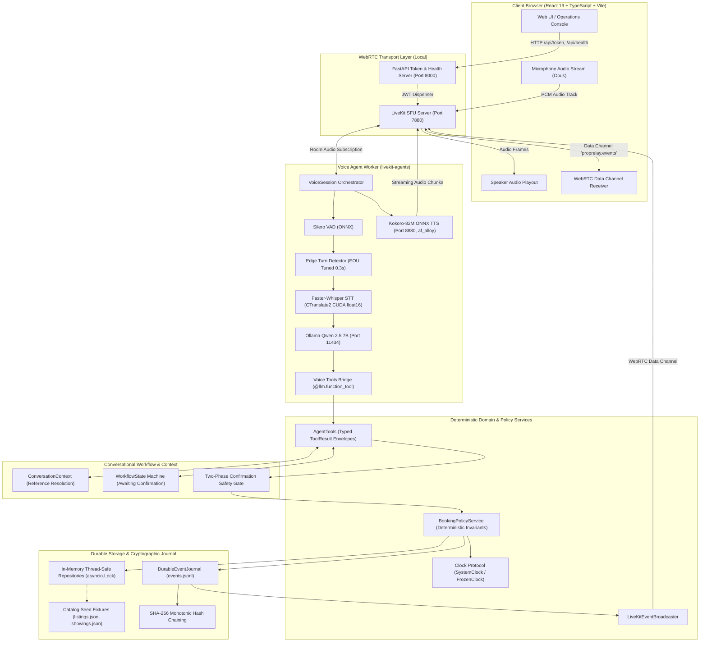

# System Architecture Diagram

This diagram documents the end-to-end component topology of PropRelay, from the browser WebRTC client through the local audio pipeline, agent runtime, deterministic domain services, and audit storage.

## Architectural Highlights

1. **Untrusted Language Model Boundary**: The LLM interprets conversational intent and selects tool calls. It never directly mutates domain state, verifies schedules, or marks reservations confirmed.
2. **Zero Cloud Dependencies**: All inference (Faster-Whisper STT, Ollama LLM, Kokoro TTS, Silero VAD) runs 100% locally on localhost loopback.
3. **Durable-Before-Broadcast Event Sourcing**: Every state mutation is cryptographically appended to `events.jsonl` with SHA-256 hash chaining before being broadcast over the WebRTC data channel.
4. **Decoupled Architecture**: Domain services and repositories have zero imports of WebRTC or HTTP transport code, ensuring high testability and clean separation of concerns.
