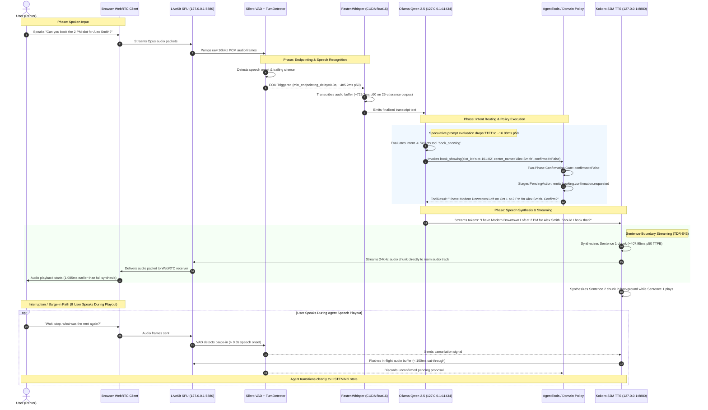

# Voice Turn Sequence Diagram

This sequence diagram depicts a complete voice turn cycle, showing the progression from microphone audio capture through acoustic endpointing, transcription, speculative prompt evaluation, deterministic tool execution, sentence-boundary TTS streaming, and audio playback.

## Measured Stage Latency Profile (Warm-Path Reference: NVIDIA RTX 5090)

| Turn Segment | Measured Mechanism | Baseline (ms) | Optimized p50 (ms) | Delta (ms) |
| :--- | :--- | :--- | :--- | :--- |
| **VAD / EOU Commitment** | Tuned endpointing (`min_delay=0.3s`) | 932.4 ms | **485.2 ms** | **-447.2 ms** |
| **Local STT (base.en CUDA)** | CTranslate2 float16 | 344.0 ms *(single clip)* | **729.2 ms** *(25 diverse fixtures)* | *Non-comparable datasets* |
| **LLM TTFT** | Speculative trailing evaluation | 75.5 ms | **16.98 ms** | **-58.5 ms** |
| **LLM Full Generation** | Resident Qwen 2.5 7B (136.4 tok/s) | 662.8 ms | **216.3 ms** | **-446.5 ms** |
| **Tool / Policy Execution** | SafeReadOnlyCache + sorted lock | 0.8 ms | **< 0.2 ms** | **-0.6 ms** |
| **TTS First Audio Chunk** | Sentence-boundary streaming | 727.5 ms | **407.95 ms** | **-319.6 ms** |
| **Total Conversational Turn** | End-of-utterance to first audio | **2,003.9 ms** | **1,439.3 ms** | **-564.6 ms (28.2% reduction)** |
